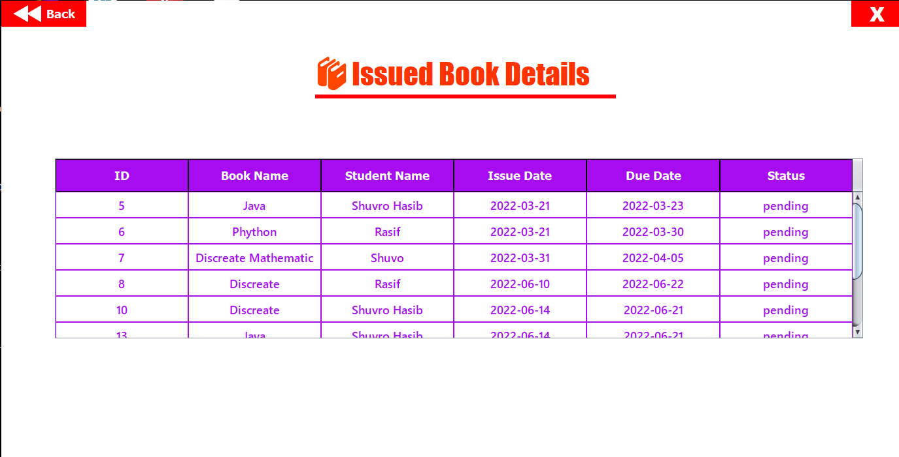

## PSTU Library-Management-System

The library management system is a software developed for monitoring and controlling the transactions in the
library. The system maintains the record of books available in the library. It mainly focuses on adding new
members, books, author and publisher details. The system also facilitates easy searching, issuing and returning
of books. The system also shows the borrow details like lend date, return date, penalty / fine. The system also
provides the facility to search for books based on authors and publishers as well. The system also provides the
facility to monitor the members of the library.

## 🏁 Technology Stack

- Core-Java
- MySQL
- JavaSwing

## Screenshot:

  <h3> Home Page:</h3>
  
   
   
  <h3> SignUp Page: </h3>
  
   
   
  <h3> Login Page: </h3>
  
   
   
  <h3> ManageStudents: </h3>
  
   
   
  <h3> ManageBooks: </h3>
  
   
   
  <h3> Special Corner: </h3>
  
   
   
  <h3> Issue a Books: </h3>
  
   
   
  <h3> Return Books: </h3>
  
   
   
  <h3> Issue Book Details: </h3>
  
   
   
  <h3> View all records: </h3>
  
   
   
  <h3> Defaulter List: </h3>
  

## Drop a ⭐ on the Github Repository.
